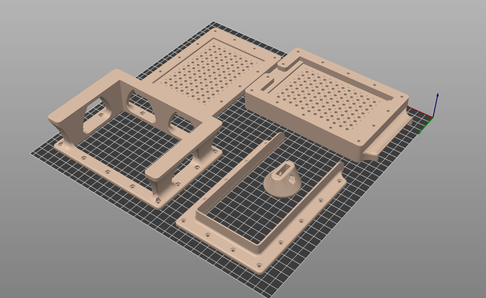

# Bead Loader

Loading lysis beads into your own tubes or plates can be a challenge. Moreover, loading a precise and repeatable amount of lysis beads is important to automated protocols, which depend on the bead layer ending up at the same height in every tube or well.

I designed this bead loading apparatus to make custom loading a fast and precise process. It uses 3D printed and laser-cut parts and is capable of quickly loading small-grained lysis media to entire plates of tubes.

There are a couple improvements I've made over similar home-brew loaders I've seen in the past:

1. Felt wiper gaskets help prevent small (0.1-0.2 mm) lysis media from leaking around the gating mechanism, and help to decrease the friction of operation.
2. A pour spout makes it easy to recover excess media when loading.

I've created two models: one, for 96-well plates, loads 250 µL of media into 1.1 mL strip tubes (Axygen MTS-11-8-C-R); and a second, for tubes, loads 600 µL of media into 2 mL screw top tubes.

## Operation

To load the dispenser, first put the slider in the 'closed' position by pulling the slider knob away from the plate. 

Next, pour some media into the hopper. Use something flat, like an old credit card or a paint scraper, to fill each well flat with media. Wipe any excess media out the spout. (I like to use disposable multi-channel reservoirs for collectin excess media.) If you only need to load a partial plate, you can use lab tape to block some of the wells prior to adding media.

Now, place the uncapped, empty tubes under the dispenser. Press the knob all the way in. The beads should drop down into the tubes.

## Parts needed

- Approx. 500g printer filament (PETG or ABS preferred)
- [1/4" acrylic](https://www.mcmaster.com/8589K81/) for slider
- [1/8" wool felt](https://www.mcmaster.com/8759K71/) for gaskets
- 12x M3x45 mm socket- or button-head cap screws
- 2x M3x40 mm button-head cap screws
- 14x M3 hex nuts
- 1x M5x16-20 mm flat head socket cap screw
- 1x M5 nut

## Printing, cutting, and assembly

### 3D printed parts

Place the parts in the following orientation for printing: 

This is a lot of plastic--it may take a few days to print in total, so plan ahead! No supports should be necessary.

Because there are significant loads from the compression of the screws and the felt gaskets, I'd recommend printing with at least 1.5 mm solid top and bottom infill layers, and at least 2mm total perimeter thickness (i.e. 5 perimeters at 0.4 mm line width). 

PLA is liable to creep over time, and because it is brittle, to crack around the scews. Thus, I do not recommend it for this part. PETG is a good choice, as it is quite printable, strong, and flexible. 

If you can print it succesfully ABS would also be a good choice; however, the very large parts are prone to warping and layer delamination unless printed in a very warm chamber. 

### Laser cut parts

The slider should be laser cut from 1/4" acrylic sheet (6mm may also work). Extruded acrylic gives nice polished edges, but is somewhat less strong than cast acrylic.

The felt gaskets should be cut from 1/8" thick **wool** felt (do not use synthetic felt, as it will melt in the laser). I used felt with a durometer of 50A from McMaster-Carr.

Both materials can be cut successfully on a 40W CO2 laser; please do some test cuts to find the appropriate power and speeds for your machine.

### Assembly

Press the felt gaskets into their depressions in the 'upper' and 'lower' printed parts. (The little spikes help secure the gasket in place, so it doesn't shift when the slider is actuated.) Then, place the cut slider on top of the felt in the 'upper' piece, and flip the whole stack over onto the 'lower' part and felt. Use the M3 screws and nuts to fasten the whole stack together. Attach the knob to the slider with the M5 screw and nut.

You can use the compression on the screws to modulate how tightly the slider is gripped between the two felt gaskets, and thus how easy it is to actuate. 