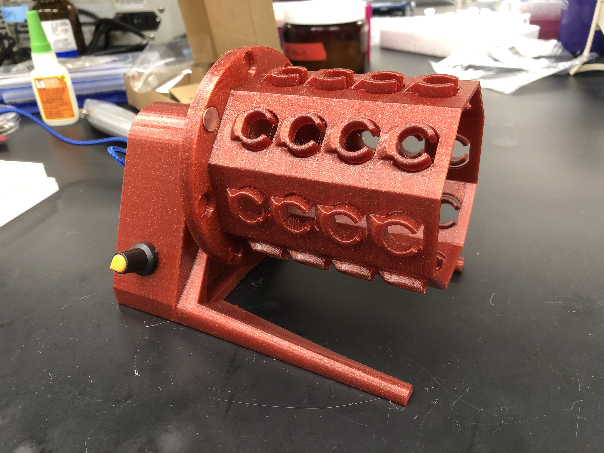
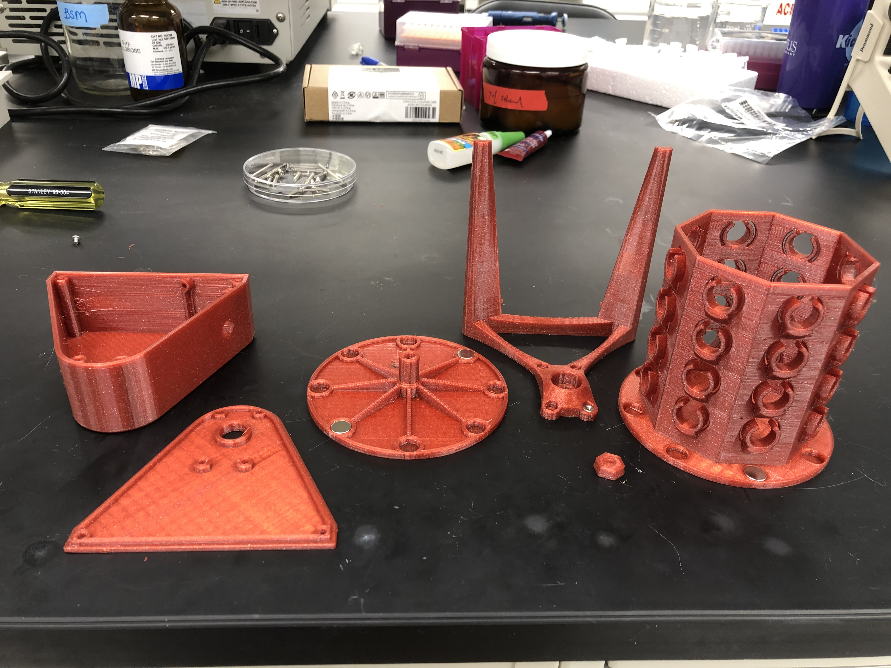

# Laboratory Rotator

I'm doing a lot of magnetic bead DNA purification protocols, and they frequently have a step that requires rotating the tube at a low speed for 5-10 minutes. Until now, I'd been taping the tubes to the rotator shaft of the forgotten hyb oven in the hood of the lab next door. Then I realized I had a set of spare parts laying around that could do the job for me!

This lab rotator is designed for light duty around the same DC gear motor and PWM board I used in my [low-cost remix](https://www.printables.com/model/52568-low-cost-plate-shaker) of the [Adafruit Crickit lab shaker](https://www.printables.com/model/7244-crickit-lab-shaker). It uses a USB charger as a power source, and two ball bearings to keep the motor shaft captive. I designed it with a modular, magnetically-attached tube holder so that I could swap it out for different tube sizes in the future. 

The version the I built uses a 1:48 geared motor, but the 1:90 geared version would be more appropriate for this application.

## Parts needed:

- [1:90 DC gear motor](https://www.adafruit.com/product/3801)
[PWM board](https://www.amazon.com/Onyehn-Voltage-Controller-1803BK-Adjustable/dp/B07NPJ5MQR/ref=sr_1_12?dchild=1&keywords=pwm+motor+controller&qid=1614884593&sr=8-12)
- [0.1 µF ceramic capacitor](https://www.adafruit.com/product/753)
- [Panel mount micro USB connector](https://www.adafruit.com/product/3258)
- Fasteners (all available in [this set](https://www.amazon.com/iExcell-Stainless-Socket-Button-Washers/dp/B07L65DHV6/ref=sr_1_5?crid=15HZSXPUA0OYK&keywords=m3+button+head+screw+assortment&qid=1648741726&sprefix=m3+button+head+screw+assortmen%2Caps%2C85&sr=8-5)):
	- 4x 45mm M3 screws
	- 2x 30mm M3 screws
	- 1x 25mm M3 screw
	- 2x 6mm M3 screws
- 6x M3x5x4mm threaded [heat-set inserts](https://www.mcmaster.com/94180A331/) 
- 2x [10x15x4mm (6700-2RS) ball bearings](https://www.amazon.com/uxcell-6700-2RS-Groove-Bearings-Double/dp/B082PR3DFZ/ref=sr_1_4?crid=QEFSAOYUJ5M2&keywords=10x15x4mm+bearings&qid=1648742088&sprefix=10x15x4mm+bearing%2Caps%2C82&sr=8-4)
- 12x [1/16" x 3/8" neodymium magnets](https://www.kjmagnetics.com/proddetail.asp?prod=D61)

## Printing and assembly

I printed the motor shaft with 4 perimeters, as all of the weight of the rotator assembly will be transmitted through that point.

You will need to use supports only under the hexagonal indentation on the printed shaft.

### Add heat-set threaded inserts

There are six spots for heat-set inserts in the bearing housing / legs part. Four insert from the back, and two from the front. Press them in using a soldering iron on a low heat setting.

### Assemble the motor shaft

The hexagonal nut has two sides with very slight tapers. The shorter/wider side snaps into the corresponding pocket on the shaft, and serves to index the tube holder to the shaft. I put a dab of super glue on the nut before snapping it in to the shaft.

The magnets should just snap into the holes on the shaft. You can also dab some super glue to keep them in there if you want.

### Press in the bearings

I press fit the bearings into the outer bearing housing, starting the first bearing with my fingers and then turning it upside down and pressing it in with the bench top. I then pushed it a bit farther with my fingers and then put the second bearing on top of it the same way.

Then, the motor shaft could be carefully pressed in to make a rotating assembly. You might find that the shaft is a little loose or a little tight depending on your printer. You can either adjust the tolerances using the Fusion360 file, or either sand the shaft down a little or wrap it in some teflon tape to make it fit.

### Assemble the electronics

Cut off all but about 2 inches of the cord from the panel mount USB connector. Remove all of the external rubber cable guard, the insulation, and the green and white wires. Strip a few mm of insulation from the red and black wires and connect them to the Power + and Power - terminals on the PWM board, respectively. Then connect the red and black wires from the DC gear motor to the Motor + and Motor - terminals on the board.

Solder the ceramic capacitor between the two motor leads, right next to the motor. This will limit the spike in current throught the motor windings on startup, helping to extend its lifetime.

Mount the USB connector to the enclosure shell with the included M3 screws. Pull the plastic knob off the PWM board, remove the nut, and push the metal potentiometer shaft through the corresponding hole in the enclosure. Tighten the nut back on to retain the potentiometer shaft in the housing. Two holes in the edge of the circuit board should line up with holes in the outside of the enclosure. You can affix the board using short M3 screws.

### Drivetrain assembly

Attach the motor to the flat housing piece and the stand / bearing housing with 2 30mm M3 screws. Line the flats of the motor shaft up with the corresponding flats on the inside of the large printed shaft assembly. Push the 30mm M3 screws through the holes in the gear motor, through the holes in the triangular housing panel, through the holes in the bearing housing, and tighten into the M3 threaded inserts.

Now, you can tighten the printed magnetic shaft onto the motor shaft using the remaining 30mm M3 screw and the hexagonal printed nut. Making sure you've removed the supports from the printed shaft indentation, press the shorter, wider taper of the printed nut into the recess. Push the 30mm M3 screw into the hole in the center of the nut and thread it into the motor shaft. Don't overtighten this -- you only want to make sure the printed shaft is positively retained in the motor.

### Assemble the rest of the housing

You can now click the housing 'shell' onto the triangular panel, and push 45mm M3 screws through all three pieces and tighten them into the threaded inserts.

